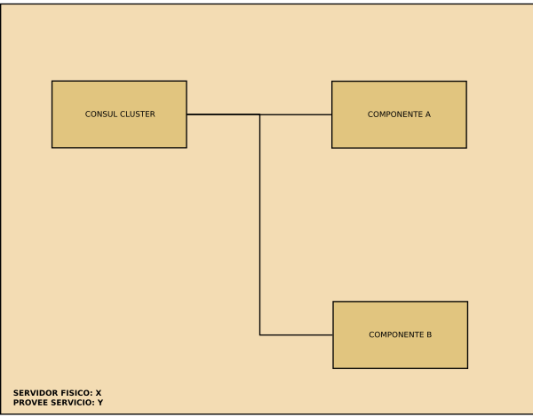

.. _servicios:

=========
Servicios
=========

Un servicio es un conjunto de componentes acoplados que proveen una funcionalidad.

En el ambito de Canaima Instituciones los componentes de un Servicio son:

* Un cluster de Consul (como minimo 1 nodo) que gestionara los otros componentes del servicio.
* Por lo menos 1 nodo que proveea alguna funcionalidad.

.. _requisitos:

Requisitos para crear un servicio
=================================

* La plataforma de virtualización (Xen/Docker) debe estar instalada en el servidor fisico
* Servidor de consul
* Se necesita un usuario con privilegios de administrador para ejecutar los comandos
* El servidor fisico debe tener acceso a internet o a un repositorio (para descargar paquetes durante la instalacion)

.. _procedimiento:

Procedimiento de despliegue
===========================

- Se instalan los paquetes de software necesarios en el host (plataforma de virtualización, consul como servidor)
- Se copia a traves de SSH la receta correspondiente
- Se ejecuta la receta: Crea el contenedor de virtualizacion, instala el software del servicio, lo configura e inicia el servicio

.. _recetas:

Recetas
=======

TODO

¿Que es una receta?

¿Como se usan las recetas?

¿Como se hace una receta?

¿Que compone una receta? 

¿Porque no usar Charms o Dockerfiles en lugar de recetas?

¿Como es el esquema de distribución de los servicios?

.. _componentes:

Componentes de un servicio
==========================

TODO

.. _pasos:

Pasos para crear un servicio
============================

* Acceder a la maquina fisica.
* Desplegar un nodo con Consul.
* Desplegar los nodos de cada componente del servicio.
* Conectar los componentes según corresponda.

.. _esquema:

Esquema de servicios
====================

TODO

.. _investigar:

Por investigar
==============

* Desconección de un nodo/componente programaticamente.
* Ejecución de tareas concurrentemente en Fabric.
* Consultar resultado de un Check (Consul).
* Agregar checks dinamicamente.
* Usar HAproxy para redirigir peticiones a los contenedores correspondientes.
* Montar un servicio de base de datos en un volumen externo al contenedor.
